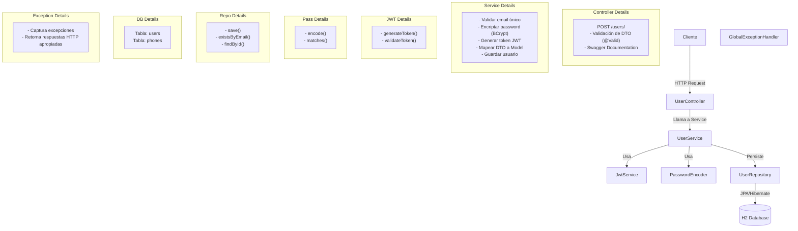

# API REST gestion usuario - Prueba tecnica SERMALUC JUAN MARTINEZ  SIMI

## Requisitos previos

- Java 17 o superior
- Gradle 8.x (incluido con Gradle Wrapper)
- Git

## Frameworks y librerias utilizadas

- **Spring Boot 3.2.1** - Framework principal
- **Spring Data JPA** - Persistencia de datos
- **H2 Database** - Base de datos en memoria
- **JWT (jjwt 0.12.3)** - Autenticación y autorización
- **Lombok** - Reducción de código boilerplate
- **SpringDoc OpenAPI (Swagger)** - Documentación de API
- **JUnit 5 + Mockito** - Testing

## Instalación y ejecución

```bash
git clone https://github.com/FranMartinezSimi/pruba_sermaluc.git
cd prueba_tecnica

compilar por consola 
./gradlew clean build

ejecutar por consola 
./gradlew bootRun
```

## Documentacion API SWAGGER
- Swagger UI: http://localhost:8080/swagger-ui.html
- OpenAPI JSON: http://localhost:8080/v3/api-docs

## Configuracion application.properties
```bash
spring.datasource.url=jdbc:h2:mem:testdb
spring.datasource.driverClassName=org.h2.Driver
spring.datasource.username=sa
spring.datasource.password=

# JPA/Hibernate
spring.jpa.database-platform=org.hibernate.dialect.H2Dialect
spring.jpa.hibernate.ddl-auto=create-drop
spring.jpa.show-sql=true

# H2 Console
spring.h2.console.enabled=true
spring.h2.console.path=/h2-console

# JWT Configuration
jwt.secret=your-secret-key-here-minimum-256-bits-for-hs384-algorithm
jwt.expiration=3600000

```

## Ejecutar curl
```bash
curl -X POST http://localhost:8080/users/ \
  -H "Content-Type: application/json" \
  -d '{
  "name": "Juan Pérez",
  "email": "juan@example.com",
  "password": "Pass123@",
  "phones": [
    {
      "number": "987654321",
      "cityCode": "2",
      "countryCode": "56"
    }
  ]
}'


Response
{
  "id": "550e8400-e29b-41d4-a716-446655440000",
  "created": "2025-12-05T10:30:00",
  "modified": "2025-12-05T10:30:00",
  "lastLogin": "2025-12-05T10:30:00",
  "token": "eyJhbGciOiJIUzM4NCJ9...",
  "isActive": true
}
```

## validaciones endpoint users/
Email
- Formato válido de email
- Debe ser único en el sistema
  
Password
- Formato configurable mediante regex en application.properties.
- Por defecto: Al menos una letra mayúscula, letras minúsculas y dos números.
  
Teléfono

- number: Solo dígitos, entre 7-15 caracteres
- cityCode: 1-4 dígitos
- countryCode: 1-4 dígitos

## Testing
```bash
./gradlew test
```

## Arquitectura de solucion
```
src/
├── main/
│   ├── java/
│   │   └── com/sermaluc/prueba_tecnica/
│   │       ├── config/              # Configuraciones (Swagger, Security)
│   │       ├── domain/
│   │       │   ├── dto/             # Data Transfer Objects
│   │       │   ├── exceptions/      # Excepciones personalizadas
│   │       │   └── models/          # Entidades JPA
│   │       ├── infraestructure/
│   │       │   ├── controllers/     # Controllers REST
│   │       │   └── repository/      # Repositorios JPA
│   │       └── services/            # Lógica de negocio
│   └── resources/
│       └── application.properties   # Configuración de la aplicación
└── test/
    └── java/                        # Tests unitarios e integración
```
## Diagrama de solución


## Modelo de datos

### UserModel
| Campo | Tipo | Descripción |
|-------|------|-------------|
| `id` | UUID | Primary Key |
| `name` | String | Nombre del usuario |
| `email` | String | Email único del usuario |
| `password` | String | Contraseña encriptada (BCrypt) |
| `createdAt` | LocalDateTime | Fecha de creación |
| `modifiedAt` | LocalDateTime | Fecha de última modificación |
| `lastLogin` | LocalDateTime | Fecha de último login |
| `token` | String | Token JWT generado |
| `isActive` | Boolean | Estado del usuario |
| `phones` | List\<PhonesModel\> | Lista de teléfonos del usuario |

### PhonesModel
| Campo | Tipo | Descripción |
|-------|------|-------------|
| `id` | Long | Primary Key |
| `number` | String | Número telefónico |
| `cityCode` | String | Código de ciudad |
| `countryCode` | String | Código de país |
| `user` | UserModel | Foreign Key - Usuario propietario |

### Relación
- Un `UserModel` puede tener múltiples `PhonesModel` (relación One-to-Many)
- La relación usa `CascadeType.ALL` para operaciones en cascada


## Diagrama de solución
```
┌─────────────┐
│   Cliente   │
└──────┬──────┘
       │
       │ HTTP Request
       ▼
┌─────────────────────────────────────────┐
│         UserController                  │
│  ┌────────────────────────────────────┐ │
│  │  POST /users/                      │ │
│  │  - Validación de DTO (@Valid)      │ │
│  │  - Swagger Documentation           │ │
│  └────────────────────────────────────┘ │
└──────────────┬──────────────────────────┘
               │
               │ Llama a Service
               ▼
┌─────────────────────────────────────────┐
│         UserService                     │
│  ┌────────────────────────────────────┐ │
│  │  - Validar email único             │ │
│  │  - Encriptar password (BCrypt)     │ │
│  │  - Generar token JWT               │ │
│  │  - Mapear DTO a Model              │ │
│  │  - Guardar usuario                 │ │
│  └────────────────────────────────────┘ │
└──────────┬──────────────────────────────┘
           │
           │ Usa
           ▼
┌──────────────────────┐    ┌──────────────────────┐
│   JwtService         │    │  PasswordEncoder     │
│  - generateToken()   │    │  - encode()          │
│  - validateToken()   │    │  - matches()         │
└──────────────────────┘    └──────────────────────┘
           │
           │ Persiste
           ▼
┌─────────────────────────────────────────┐
│         UserRepository                  │
│  ┌────────────────────────────────────┐ │
│  │  - save()                          │ │
│  │  - existsByEmail()                 │ │
│  │  - findById()                      │ │
│  └────────────────────────────────────┘ │
└──────────────┬──────────────────────────┘
               │
               │ JPA/Hibernate
               ▼
┌─────────────────────────────────────────┐
│       H2 Database (In-Memory)           │
│  ┌────────────────────────────────────┐ │
│  │  Tabla: users                      │ │
│  │  Tabla: phones                     │ │
│  └────────────────────────────────────┘ │
└─────────────────────────────────────────┘

┌─────────────────────────────────────────┐
│     GlobalExceptionHandler               │
│  - Captura excepciones                   │
│  - Retorna respuestas HTTP apropiadas    │
└─────────────────────────────────────────┘
```

